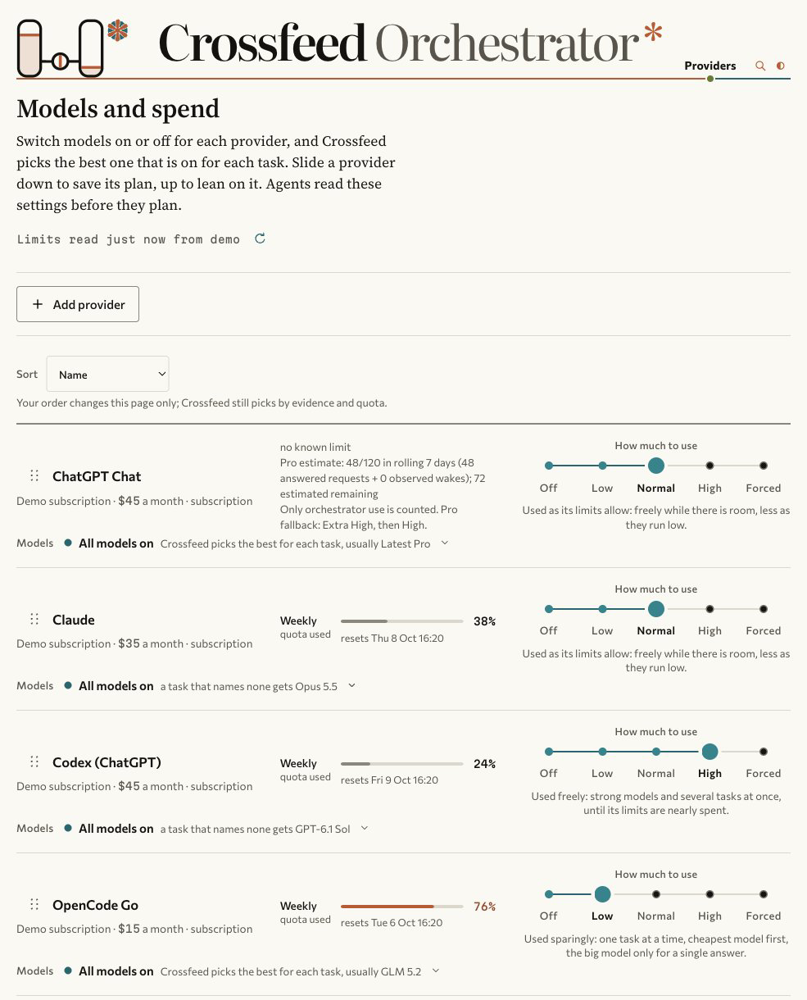
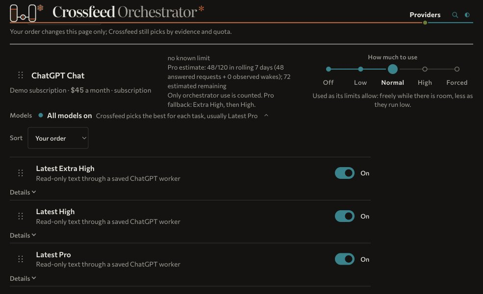

# Crossfeed Orchestrator
Crossfeed Orchestrator routes AI coding work across your subscriptions and supervises each worker.

If you pay for several AI plans, your agents can use the others when one runs low. A local console sets which models they may use and how freely to spend each plan. Routing reads those settings before every job.

<picture>
  <source media="(prefers-color-scheme: dark)" srcset="docs/console-dark.png">
  
</picture>

The screenshots use fictional plans, prices and usage. [Run the demo](docs/DEMO.md) to see the same console without connecting an account.

## Install

You need Python 3.9+, bash, [jq](https://jqlang.org) and the vendor CLIs you want to use, each installed and signed in. Crossfeed uses the Python standard library.

```bash
git clone https://github.com/ABCastor/crossfeed-orchestrator ~/crossfeed-orchestrator
cd ~/crossfeed-orchestrator
mkdir -p ~/.config/orchestrator
cp examples/access-overlay.example.json ~/.config/orchestrator/access-overlay.json
python3 scripts/fleetctl.py doctor
python3 scripts/fleetctl.py console
```

The *overlay* is your machine's roster of plans, models and roles. The example has illustrative settings: replace them with your own, keep only signed-in, tested CLI lanes `verified`, and mark the rest `unverified`. `doctor` reports missing tools and setup gaps. In the console, **Add provider** connects a supported CLI or API endpoint without hand-editing the roster. API and CLI lanes still need verification before dispatch.

Agents can read [the skill](skill/SKILL.md) from the checkout; [skill installation](docs/SKILL-INSTALL.md) covers Claude Code, Codex, OpenCode and Pi. Linux setup is in [docs/LINUX.md](docs/LINUX.md).

Crossfeed runs on its own with [Claude Code](https://docs.anthropic.com/en/docs/claude-code), [Codex](https://github.com/openai/codex), [Antigravity](https://antigravity.google), [OpenCode](https://opencode.ai), [Copilot CLI](https://github.com/github/copilot-cli) and [OpenRouter](https://openrouter.ai). [Pi](https://github.com/earendil-works/pi) supports admitted API and partner-plan routes.

Optionally, add [Crossfeed Chat](https://github.com/ABCastor/crossfeed-chat) to use your ChatGPT chats as a read-only agent lane. Its paired Chrome extension wakes sleeping workers; [setup and relay limits](docs/CHATGPT.md).

`python3 scripts/fleetctl.py serve-api` exposes admitted read-only lanes to OpenAI-compatible clients; [API setup](docs/LANES-API.md).

## Give it work

```bash
python3 scripts/fleetctl.py brief
python3 scripts/fleetctl.py select --role implementation --json
python3 scripts/fleetctl.py dispatch --role review --mode read-only \
  --prompt "Review the retry paths and report concrete defects." --dir "$PWD" \
  --last /tmp/review.txt
```

A *lane* is a model on a particular tool, funded by a quota pool. Crossfeed selects a lane and thinking level for the task, then runs its wrapper under a lease and watchdog. Each run records the selected model; provider identity is confirmed only when the provider supplies it.

The console has five spend levels: **off**, **low**, **normal**, **high** and **forced**. Model switches restrict which choices are available. Known exhaustion, provider refusals and configured paid caps remain hard gates, even at forced. Missing quota measurements stay unknown. See [quota sources](docs/QUOTA-REFRESH.md).



For parallel jobs, use `scripts/fanout.sh tasks.jsonl --parallel 3`. Give write-capable workers separate worktrees and verify their output before integrating it. [Selector details](docs/SELECTOR.md) and [adapter contracts](docs/ADAPTERS.md) cover configuration.

## Evidence and limits

**The selector has not yet been proven better than simpler routing policies on hard tasks.** A re-tuned private benchmark round is in progress as of 4 October 2026. The [benchmark harness](bench/README.md) lets you measure your own tasks.

The Copilot adapter is a single read-only Auto observer. Antigravity requires write mode because its wrapper has no proven read-only boundary. Paid caps use recorded estimates and a run can overshoot, so use provider-side limits too. ChatGPT chat lanes are read-only and separate from Codex quota.

```bash
bash tests/run-all.sh
```

The suite uses synthetic data and fake transports. It does not prove a live provider is available or that an agent's answer is correct.

## Licence

The code is [MIT](LICENSE). The signature artwork and bundled fonts have separate terms in [NOTICE](NOTICE).

<p>
  <a href="https://abcastor.com">
    <picture>
      <source media="(prefers-color-scheme: dark)" srcset="docs/castor-footer-dark.svg">
      <source media="(prefers-color-scheme: light)" srcset="docs/castor-footer-light.svg">
      
    </picture>
  </a>
</p>
